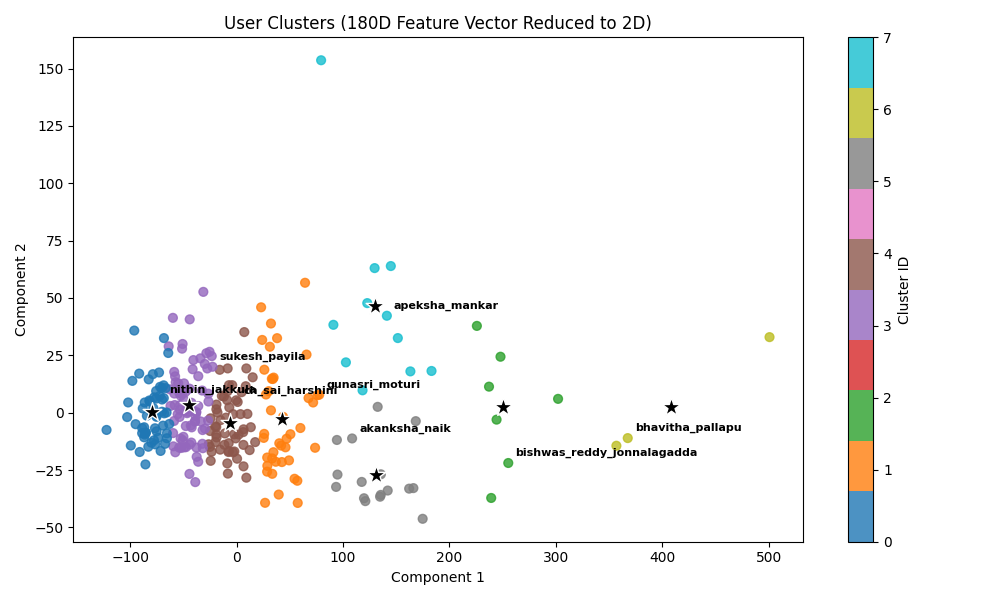

# 🧠 Group-Based-Coding-Practice

🚧 Note: This project is currently under development and not yet fully complete. The goal is to build a smart, group-based coding platform that promotes collaborative learning and personalized improvement.

---

## 💡 Project Idea

Group-Based-Coding-Practice is a data-driven platform designed to help programmers improve their coding skills by:

- Forming practice groups
- Tracking individual and group performance
- Using machine learning to generate personalized topic suggestions
- Encouraging competition and collaborative learning within and between groups

The project leverages scraped data from LeetCode and Codeforces, normalizes it, and analyzes user performance via KMeans clustering and KNN similarity to generate insights and recommendations.

The long-term vision includes integrating this backend module with a MERN stack frontend for a full-stack learning platform.

---

## 📌 Features

- 👥 Group-based coding practice with JSON-based metadata
- 🧮 60D and 180D feature vector generation from normalized user data
- 🔍 Smart clustering (KMeans) and similarity detection (KNN)
- 📊 Personalized insights comparing user vs. better-performing peer
- 🧠 Fallback logic for isolated users using nearest cluster centroids
- 📁 Fully modular structure ready for web integration
- 🖼️ Future: PCA/TSNE visualizations of user clusters

---

## 🗂️ Project Structure

Group-Based-Coding-Practice/
│  
├── clustering/ - ML logic: feature vectors, KMeans, KNN  
│ ├── generate_features.py  
│ ├── kmeans_clustering.py  
│ └── knn_within_cluster.py  
│  
├── insights/ - Insight Generator Bot  
│ └── generate_insight.py  
│  
├── scrapers/ - LeetCode + Codeforces scrapers and normalizers  
│ ├── leetcode_scraper.py  
│ ├── codeforces_scraper.py  
│ └── aggreagte.py  
│  
├── groups/ - Group-level data with individual user data and metadata (JSON)  
├── utils/ - Helpers for user creation and file loading  
│ ├── create_user.py  
│ ├── delete_user.py  
│ ├── load_all_users.py
│ ├── normalizer.py  
│ └── update_user.py  
│  
├── visualization/ - Planned cluster visualization  
├── test_sample/ - Optional test scripts or sample data for testing
├── main.py - Entry point (for login/registration/API access) not implemented yet
├── requirements.txt - Python dependencies  
├── .gitignore

---

## ⚙️ How It Works

1. **User + Group Creation**

   - Users register or join groups using create_user.py
   - Each group JSON contains name, size, members, and user data

2. **Data Collection**

   - Scrapers fetch data from LeetCode & Codeforces via API/GraphQL
   - Submissions, topics, difficulty, languages are parsed and normalized

3. **Feature Vector Generation**

   - Each user is represented as a 60D or 180D vector:
     - Accuracy, unique problem stats, normalized tag and difficulty distribution

4. **Clustering & Similar User Search**

   - KMeans clusters similar users
   - KNN finds best-matching peer within the same or nearest cluster
   - If cluster is too small, fallback logic uses centroid similarity

5. **Insight Generation**
   - Compares user vs. better peer
   - Recommends tags/difficulties to focus on for improvement

---

---

### 🧬 User Cluster Visualization (180D ➝ 2D PCA)

---

## 🚀 Getting Started

1. Install dependencies:  
   pip install -r requirements.txt

2. Run the app:  
   python main.py

3. Generate insights:  
   python insights/generate_insight.py

---

## 🧰 Tech Stack

- Python 3.10+
- Scikit-learn – KMeans, KNN
- NumPy, JSON – Data handling
- Requests, GraphQL – Scraping APIs
- Matplotlib, Seaborn – (Planned) Visualizations

---

## 🔭 Future Scope

- MERN stack frontend interface
- 24h auto refresh for user data
- Group vs Group analytics
- LLM integration for better natural language insights
- Leaderboards and performance gamification

---

## 🙌 Contributing

Pull requests and feedback are welcome!  
To contribute, please open an issue to discuss improvements or bugs.

---

---

## 👤 Author

**Yagnesh Ummidala**  
GitHub: https://github.com/Yagneshummidala
